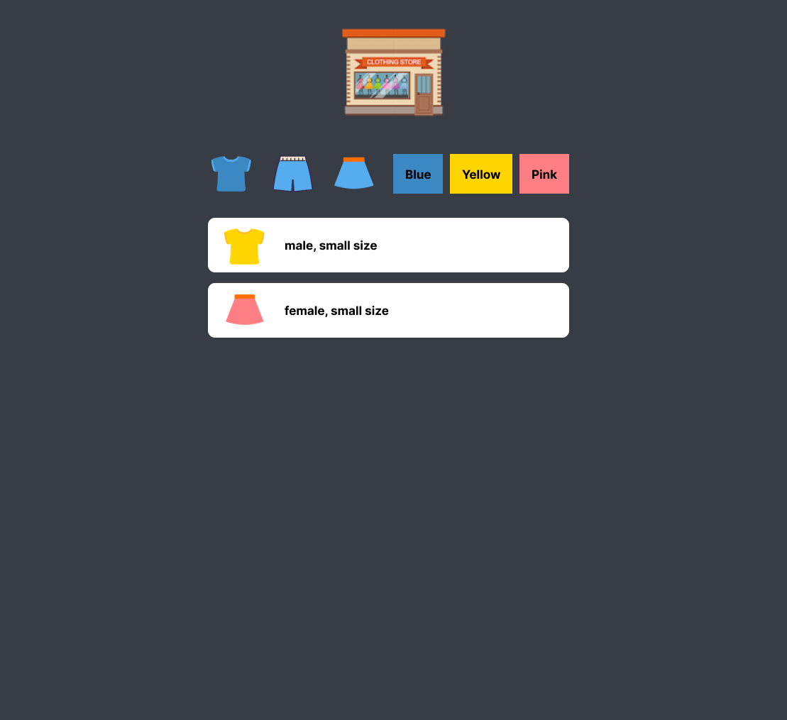

# Mini-Shop

메인화면에서 상단의 아이콘 버튼을 클릭하면 필터링 되어 해당 아이템들만 목록에 보여주는 미니 프로젝트 입니다. 

  
목차

  <ol>
    <li><a href="#project">Project</a></li>
    <li><a href="#preview">Preview</a></li>
    <li><a href="#skills">Skills</a></li>
    <li><a href="#implement">Implement</a></li>
    <li><a href="#reference">Reference</a></li>
    <li><a href="#problem-solving-process">Problem Solving Process</a></li>
  </ol>

 

---

 

## Project

드림코딩 자바스크립트 미니 게임 프로젝트 

## Preview

- Figma Design 
  
   
  

  - Desktop 

- Mobile 

## Skills

- JavaScript
- HTML / CSS

## Implement

- Scolling
- Filter
- layout

## Reference

## Problem Solving Process

- 기존 코드
- 해결 코드
