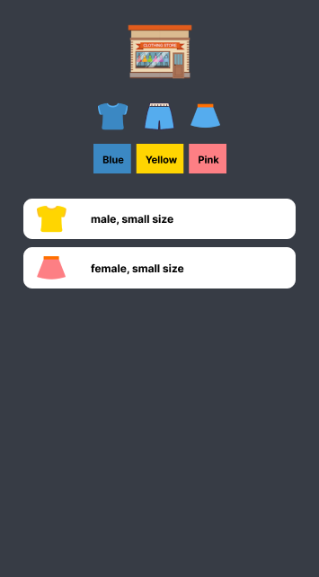

# Mini-Shop

메인화면에서 상단의 아이콘 버튼을 클릭하면 필터링 되어 해당 아이템들만 목록에 보여주는 미니 프로젝트 입니다. 

  
목차

  <ol>
    <li><a href="#project">Project</a></li>
    <li><a href="#preview">Preview</a></li>
    <li><a href="#skills">Skills</a></li>
    <li><a href="#implement">Implement</a></li>
    <li><a href="#reference">Reference</a></li>
    <li><a href="#problem-solving-process">Problem Solving Process</a></li>
  </ol>

 

---

 

## Project

드림코딩 자바스크립트 미니 게임 프로젝트 

## Preview

- Figma Design 
  
   
  

- Desktop 

- Mobile 

## Skills

- JavaScript
- HTML / CSS

## Implement

- Scolling
  css style 속성을 사용하여 정해진 높이 이상을 넘어가면 스크롤링으로 리스트를 볼 수 있도록 하였습니다.

- Filter
  리스트 안의 아이템들은 html element가 아닌 JS를 이용하여 동적으로 아이템들을 받아오도록 하였습니다.

- Logic
  리소스의 공통된 규칙을 정의하여 변수에 담았고 변수에 할당된 값을 가지고 배열을 만들었습니다.

방법

1. 배열 활용
   blue, pink, yellow array들을 각각 만든다.
   그러면 function color, function cloths를 만들 수 있다.
   각 버튼을 클릭하면 만들어두었던 각각의 배열들을 리턴해주면 된다.

2. 변수를 배열에 담아서 인덱스를 활용해 배열을 만든다.
   두 배열을 만든 다음 그 조합으로 새로운 배열을 리턴한다. 분류가 제대로 되지 않을 가능성이 높다.

3. JSON
   값을 이미지 태그의 string 값으로 받아오는 것은 오류가 발생할 수 있으니,
   오브젝트 타입으로 각 아이템의 값을 저장해놓고, JSON으로 불러오고자 하는 값을 불러오면 되지 않을까?
   {
   티셔츠 블루
   }
   {
   스커트 핑크
   }...

## Reference

## Problem Solving Process

1. CSS root 설정
   중복과 오류를 줄이기 위해 color, font-size 등 자주 사용되는 값들을 root에 따로 저장해두었습니다.

2. 최적의 Class name 지정
   컴포넌트 단위로 나누어 같은 속성들로 묶고, Class name을 동일하게 하여 스타일이 중복되지 않고 코드가 길어지지 않도록 하였습니다.
